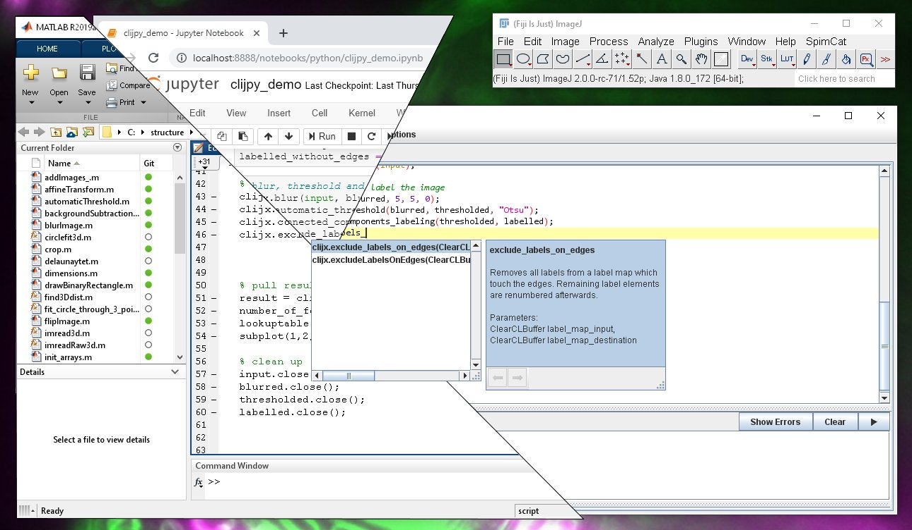

# clEsperanto

clEsperanto aims _removing language barriers_ in the scientific image analysis community. 
What if image analysts working with [Fiji](https://fiji.sc), [Icy](http://icy.bioimageanalysis.org/), [ImageJ](https://imagej.net), [Matlab](https://de.mathworks.com/products/matlab.html), [Python](https://python.org) and others would write their workflows with the same commands? What if the backend behind would be the same?
What if these algorithms would run with insane speeds because they are [GPU-accelerated](https://en.wikipedia.org/wiki/Graphics_processing_unit)?
Many algorithms will be re-implemented in the coming years for GPUs. Let's make them available 
* on all major hardware platforms, 
* on all major operating systems,
* in all major programming languages and environments,
* for free and
* open source.

This screenshot collage is not thought up. You can download plugins for these platforms and reproduce it: Copy-paste code between languages and platforms!
* [Fiji](https://clij.github.io/)
* [Icy](https://clij.github.io/clicy/)
* [Matlab](https://clij.github.io/clatlab/)
* [Python via pyImageJ](https://clij.github.io/clijpy/)
* [Python](https://github.com/clEsperanto/pyclesperanto_prototype/)
* [C++](https://github.com/clEsperanto/CLIc_prototype)

You find the [reference online](https://clij.github.io/clij2-docs/reference) of currently implemented commands. Also our provisional roadmap is [available](https://github.com/clEsperanto/clesperanto.github.io/blob/master/roadmap.md).

This is how image analysts could work together between languages and platforms:
<iframe src="images/clijmapy.mp4" width="540" height="310"></iframe>
[Download video](images/clijmapy.mp4)

Excited? Get in touch!

Robert Haase  
robert dot haase at tu minus dresden dot de  
@haesleinhuepf  

[Imprint](https://clesperanto.github.io/imprint)
